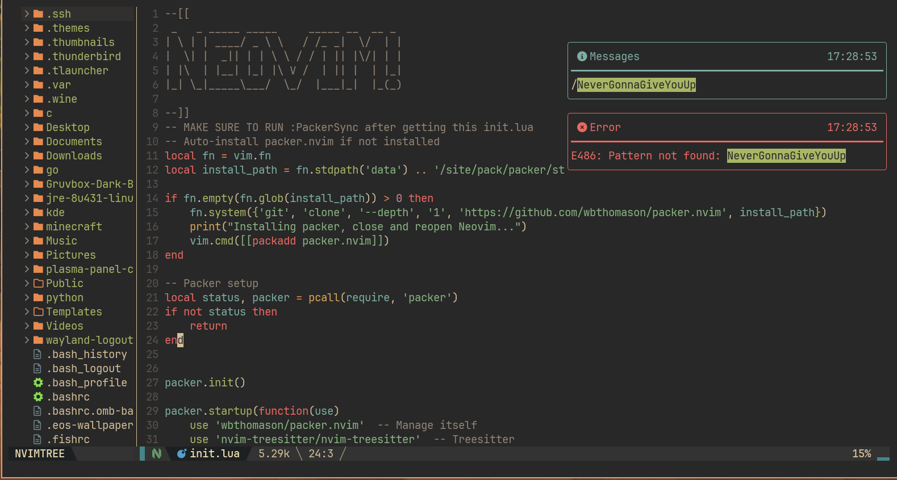

# My SwayWM Dotfiles
I've been trying out Sway and i like it more than Hyprland now.\
Hope you like these dotfiles.\
These are completely free to reproduce, use as your own, and modify.\
You can also use them in your own repos.\
The ones marked as red are required in my swayWM config.
## Utilities
- waybar (status bar)
- swww (wallpaper utility)
- wlogout (wayland logout menu)
- wayland-logout (logout button in wlogout)
- wezterm (terminal)
- thunar (file manager)
- starship (terminal prompt)
- rofi-wayland (app launcher)
- wl-clipboard (clipboard for wayland)
- dunst (notification service)
- grim and slurp (screenshotting utilities. both are required.)\
the sway config file also uses Bibata-Modern-Classic xcursor theme, so make sure to download that.
## Screenshots
### Sway and Waybar

### Wlogout

### Rofi

### Wezterm + Starship

### Dunst

## Neovim

